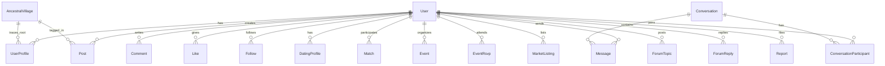

# Vlach Social — Architecture & Engineering Blueprint

## 1. System Overview & Vision
**Vlach Social** is a specialized cultural social networking, dating, and community ecosystem for the worldwide Vlach diaspora. The backend combines:
- **Social Graph & Feed**: Posts, stories, comments, likes, shares, follow relationships.
- **Cultural Heritage Engine**: Ancestral villages, historical regions, geospatial mapping, origin-based discovery.
- **Dating Engine**: Swipe/match algorithm, mutual match detection, greetings, dating preferences.
- **Real-Time Communication**: 1-to-1 messaging across three distinct contexts (social, dating, marketplace).
- **Classifieds Marketplace**: Listings, categories, image galleries, buyer-seller inquiries.
- **Events & RSVP**: Categorized cultural gatherings, geospatial map discovery, attendee tracking.
- **Community Forum**: Threaded discussions, topic tags, moderation.
- **Notification Engine**: Multi-channel notifications (Push, In-App).
- **Admin & Moderation Panel**: Content moderation, reports, user suspensions, analytics.

---

## 2. Production Engineering Standards & Principles

```
  ┌─────────────────────────────────────────────────────────────────┐
  │                        Client Layer                             │
  │               (Mobile App: Flutter / React Native)              │
  └───────────────────────────────┬─────────────────────────────────┘
                                  │ HTTPS / WSS
  ┌───────────────────────────────▼─────────────────────────────────┐
  │                      API Gateway / Reverse Proxy                │
  │       (Rate Limiting, Helmet, CORS, Compression, Logging)       │
  └───────────────────────────────┬─────────────────────────────────┘
                                  │
  ┌───────────────────────────────▼─────────────────────────────────┐
  │                     Express Application Layer                   │
  │  ┌───────────────┐ ┌───────────────┐ ┌────────────────────────┐ │
  │  │ Auth & RBAC   │ │  Rate Limiter │ │ Global Error / Zod Val │ │
  │  └───────┬───────┘ └───────┬───────┘ └───────────┬────────────┘ │
  │  ┌───────▼─────────────────▼─────────────────────▼────────────┐ │
  │  │                      Domain Modules                        │ │
  │  │  • Auth / User Profile   • Heritage Map Engine             │ │
  │  │  • Social Feed & Graph   • Dating & Match Engine           │ │
  │  │  • Real-Time Messaging   • Events & RSVP                   │ │
  │  │  • Classifieds Market    • Forum Discussions               │ │
  │  │  • Notifications         • Admin & Moderation Panel        │ │
  │  └─────────────────────────────┬──────────────────────────────┘ │
  └────────────────────────────────┼────────────────────────────────┘
                                   │
      ┌────────────────────────────┴───────────────────────────┐
      │                                                        │
┌─────▼─────────────────────────┐            ┌─────────────────▼─────────┐
│     PostgreSQL + Prisma       │            │   Real-Time / Cache Layer │
│  (Indexed, Relational Data)   │            │  (Socket.IO & WebSockets) │
└───────────────────────────────┘            └───────────────────────────┘
```

### Core Best Practices We Will Enforce:
1. **Defensive API Design**:
   - Strict input validation via **Zod** on every request body, query parameter, and route parameter.
   - Global error boundary with structured responses: `{ success, statusCode, message, errorSources?, stack? }`.
2. **Security & Resiliency**:
   - IP and User-based **Rate Limiting** (preventing brute force, spamming, and API scraping).
   - **CORS**, **Helmet** for HTTP security headers.
   - Sanitization of user input against XSS and injection.
3. **Database Performance & Data Integrity**:
   - **PostgreSQL B-Tree & Compound Indexes** on foreign keys, filtering fields (`createdAt`, `status`, `userId`, `villageId`).
   - Atomic database **Transactions (`prisma.$transaction`)** for multi-step mutations (e.g. matching logic, RSVP counters, deletion cleanup).
   - **Soft Delete Pattern** (`isDeleted: true`) on primary business records (users, posts, listings) with data retention compliance.
4. **Clean Code & Modularity**:
   - Strict separation of concerns: `Route -> Middleware -> Validation -> Controller -> Service -> Database`.
   - No business logic inside controllers or routes. Services remain pure and testable.
5. **Real-Time Architecture**:
   - Dedicated WebSocket/Socket.IO integration for messaging, live notifications, and typing indicators.

---

## 3. Database Entity Relationship Roadmap



### Key Domain Entities:
1. **User & UserProfile**:
   - Identity, Cultural roots, Current city/country, GPS Coordinates, Languages, Interests, Privacy settings (`PUBLIC`, `FOLLOWERS_ONLY`, `PRIVATE`).
2. **Heritage & Geography**:
   - `AncestralVillage`: Name, historical region, coordinates, description, historical photos, diaspora count.
3. **Social Graph & Feed**:
   - `Post`: Text, media array, post type (`STANDARD`, `STORY`, `CULTURAL_STORY`), village tag, visibility.
   - `Comment`: Threaded / hierarchical comments.
   - `Like`, `Share`, `Follow` (followerId, followingId).
4. **Dating Module**:
   - `DatingProfile`: Dating bio, photos, age, gender, interestedIn, minAge, maxAge, maxDistance, status (`ACTIVE`, `PAUSED`, `HIDDEN`).
   - `DatingSwipe`: SwiperId, TargetId, Action (`LIKE`, `PASS`, `SUPERLIKE`), createdAt.
   - `DatingMatch`: User1Id, User2Id, isMatched, matchedAt.
5. **Messaging (Unified Conversation Engine)**:
   - `Conversation`: Type (`DIRECT_SOCIAL`, `DATING`, `MARKETPLACE`), relatedEntityId (e.g. listingId or matchId).
   - `ConversationParticipant`: conversationId, userId, lastReadAt.
   - `Message`: conversationId, senderId, content, mediaUrl, messageType (`TEXT`, `IMAGE`), isRead.
6. **Events & Gatherings**:
   - `Event`: Title, category (`FESTIVAL`, `LANGUAGE_CIRCLE`, `CULTURAL`, `MEETUP`), location, coordinates, startsAt, endsAt, coverImage, capacity.
   - `EventRsvp`: eventId, userId, status (`GOING`, `INTERESTED`, `NOT_GOING`).
7. **Classifieds Marketplace**:
   - `MarketListing`: Title, description, category (`TRADITIONAL_PRODUCTS`, `ACCOMMODATION`, `SERVICES`, `TRAVEL_SHARING`, `LOCAL_BUSINESS`), price, currency, images, location, status (`ACTIVE`, `SOLD`, `EXPIRED`).
8. **Community Forum**:
   - `ForumTopic`: Category (`CULTURE`, `HERITAGE`, `LANGUAGE`, `GENERAL`), title, content, viewCount, isPinned, isLocked.
   - `ForumReply`: topicId, authorId, content.
9. **Moderation & Safety**:
   - `Report`: targetType (`USER`, `POST`, `LISTING`, `TOPIC`), targetId, reporterId, reason, status (`PENDING`, `RESOLVED`, `DISMISSED`).
   - `Block`: blockerId, blockedId.
10. **Notifications**:
    - `Notification`: recipientId, senderId, type (`LIKE`, `COMMENT`, `MATCH`, `MESSAGE`, `EVENT_REMINDER`, `SYSTEM`), entityId, isRead.

---

## 4. Phased Implementation Strategy

```
Phase 1: Foundation, Cultural Profile & Heritage Engine
Phase 2: Social Feed, Media & Social Graph
Phase 3: Dating Engine (Swipe, Algorithm, Matching)
Phase 4: Unified Messaging (Sockets + REST fallback)
Phase 5: Marketplace & Events Engine
Phase 6: Community Forums, Moderation & Admin Analytics
Phase 7: Security Hardening (Rate Limiting, Redis Caching, Profiling)
```
